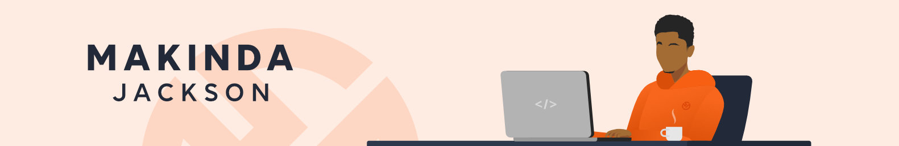

# Hi, I'm Jackson 👋🏾

I'm a ( progressive ) frontend developer ✌🏾 specializing in designing and building cool websites.
 
As a designer 🧑🏾‍🎨, bridging between design ( graphics and interface features ) and development by combining my technical knowledge to create a beautiful product. My goal is to always create & build cool-digital staffs that solve problems.

Some technologies I'm working with 👌🏾 on Bootstrap, Bulma and ReactJS, recently learning Laravel ( The PHP Framework for Web Artisans ).

Without computer with me, I'm probably reading 📙, exploring places 🌍, watching movies 🎞️ or listerning musics 🎧.

## Find me around the web 🌎:
- Cooking some code in <a href="https://github.com/makindajack" target="_blank">Github</a> 👨🏾‍🍳
- Creating cool designs at <a href="https://www.behance.net/makindajack" target="_blank">Behance</a> 👨🏾‍🎨
